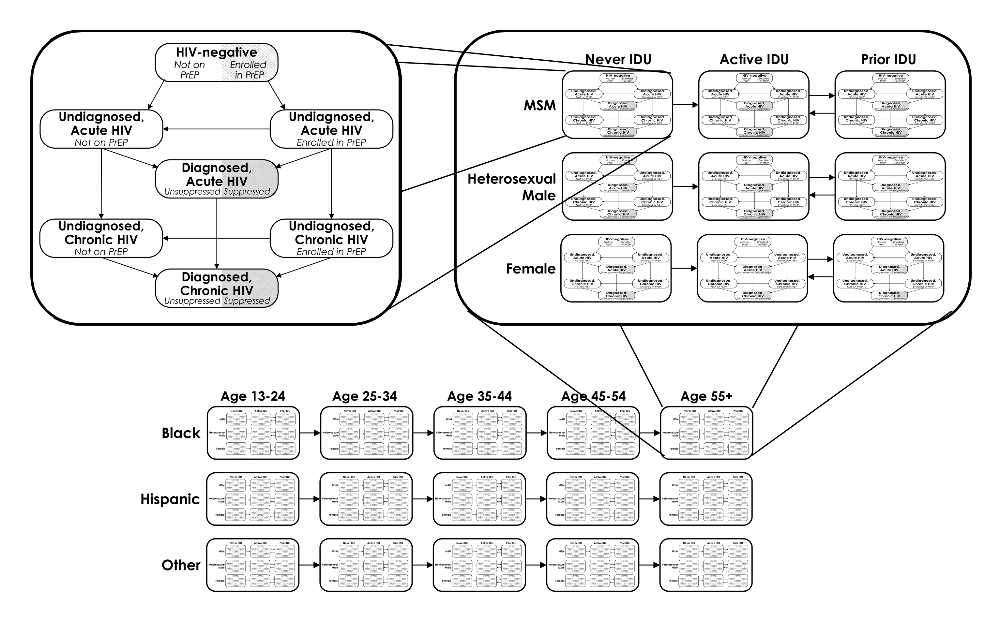

\newline
\newline
\newline

 
# The Johns Hopkins HIV Epidemiological and Economic Model (JHEEM)

## The Model Structure:

The JHEEM is a dynamic, compartmental model of HIV. It represents the adult population (13 years old and older) as stratified into four compartments with respect to HIV: uninfected, infected and unaware of their diagnosis, infected and unaware but receiving tests every 3 months as part of a PrEP program, and infected and aware of their diagnosis. The three infected states are additionally split into acute or chronic HIV. The HIV-negative compartment has an associated proportion of the population in that compartment on PrEP, and the diagnosed, HIV-positive compartments have an associated proportion of PWH who are virally suppressed.

 
The population is further stratified by age (13-24, 25-34, 35-44, 45-54, and ≥55 years old), race/ethnicity (Black, Hispanic, and other), sex/sexual behavior (female, heterosexual male, and MSM), and IV drug use (never use, active use, and prior use), for a total of 945 compartments across 135 strata of age, race, sex, and IV drug use:

 
The model represents both sexual and IV transmission of HIV. The rate of acquisition of HIV for a particular stratum is a function of a transmission rate, a stratum-specific time-varying susceptibility to infection, the prevalence of unsuppressed HIV in all strata multiplied by the probability of pairings (sexual or needle-sharing) between strata, and the proportion of individuals within the stratum on PrEP.

## Interventions
Interventions may be targeted to any of the 135 combinations of age, race, sex/sexual behavior, and IDU status.

We allow interventions to affect three aspects of HIV management:

1. HIV Testing – The rate at which undiagnosed PWH are diagnosed
2. Viral Suppression among PWH with diagnosed HIV – The proportion of PWH (aware of their diagnoses) who are virally suppressed. We assume that suppressed PWH do not transmit HIV, so the transmission of HIV from a demographic stratum decreases with increasing proportion suppressed in the stratum.
3. Pre-Exposure Prophylaxis (PrEP) – For each demographic stratum of the uninfected population we set a proportion of individuals who are enrolled in a PrEP program, which we conceive of as both a prescription for emtricitabine/tenofovir and laboratory monitoring every three months. This parameter has two effects: (a) for those on PrEP, the rate of acquisition of HIV is reduced by 86% for male-to-male sexual transmission, 75% for heterosexual transmission, and 49% for IV transmission, and (b) those who were infected while on PrEP move from undiagnosed to diagnosed HIV at an average rate of every three months.

## The Calibration Process

The JHEEM includes 131 variable parameters which governed the relative transmissibility of and susceptibility to HIV infection of demographic subgroups over time, their likelihood of receiving an HIV test, using PrEP, or achieving viral suppression, their use of injection drugs, and their propensity for mixing with other demographic subgroups. Running the model with one set of parameter values yields a simulation, which comprises simulated numbers of infections past and future.

We calibrated the model separated for each Metropolitan Statistical Area (MSA). The calibration process seeks to identify, for each MSA, a set of simulations that closely matches the observed HIV epidemic in that MSA. We have 10 calibration targets:

1. Reported Diagnoses from 2009 to 2017 from the CDC.
2. Estimated Prevalence from 2008 to 2016 from the CDC.
3. Mortality in PWH from 2009 to 2016.
4. The proportion of PWH aware of their diagnosis from 2010 to 2018, from state-level estimates provided by the CDC (except where local health departments provided publicly available estimates).
5. The number of PWH who were virally suppressed as reported by local health departments. We included all values from 2010 to 2018 which were publicly available.
6. The number of individuals receiving a prescription for emtricitabine/tenofovir, as reported by AIDSVu.
7. The probability of receiving an HIV test
8. The prevalence of injection drug use, estimated from NSDUH
9. The cumulative mortality of HIV up to 2002, obtained from CDC Wonder.
10.	Reported AIDS diagnoses from 1998-2002, obtained from CDC Wonder.

The statistical procedure that implements the calibration is Adaptive Metropolis Sampling, a Bayesian method that simulates the model parameters tens of thousands of times to approximate their probability distributions.
This web tool generates projections using a random subsample of 80 simulations.

## Publications on the JHEEM

1.	Perry A, Kasaie P, Dowdy DW, Shah M. What Will It Take to Reduce HIV Incidence in the United States: A Mathematical Modeling Analysis. Open Forum Infect Dis. 2018;5(2):ofy008.
2.	Shah M, Perry A, Risher K, et al. Effect of the US National HIV/AIDS Strategy targets for improved HIV care engagement: a modelling study. Lancet HIV. 2016;3(3):e140-146.
3.	Shah M, Risher K, Berry SA, Dowdy DW. The Epidemiologic and Economic Impact of Improving HIV Testing, Linkage, and Retention in Care in the United States. Clin Infect Dis. 2016;62(2):220-229.

